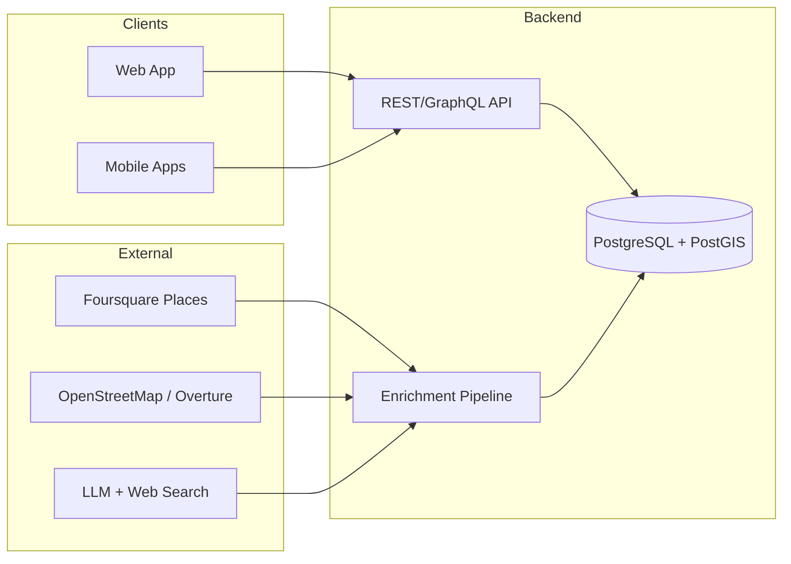

# Is It Local

> Know where your money goes. Shop in a way that reflects your values.

**Is It Local** helps you understand who really owns the place you're shopping at — whether it's **family owned**, **locally owned**, an **independent** business, a **franchise**, or **corporate owned**. In a modern capitalist society, the most direct way people can support their community is with their wallet. When it's easy to tell whether your dollars stay in the community or leave it to support big business, you can make more intentional choices about where you spend.

---

## Table of Contents

- [Vision](#vision)
- [How It Works](#how-it-works)
- [Ownership Classifications](#ownership-classifications)
- [Features](#features)
- [Architecture](#architecture)
- [Tech Stack](#tech-stack)
- [Data Sources](#data-sources)
- [Project Structure](#project-structure)
- [Getting Started](#getting-started)
- [Configuration](#configuration)
- [Roadmap](#roadmap)
- [Contributing](#contributing)
- [Data & Privacy](#data--privacy)
- [License](#license)

---

## Vision

The goal is to make the ownership structure of a business transparent and glanceable, so consumers can choose to support their local community. Starting from an aggregated business database, **Is It Local** enriches records with information gathered from the open web and LLM-assisted research. Over time, a **network effect** kicks in: as more people use the app, community-driven answers fill the gaps where online information is unclear or missing.

**Long-term north star:** point your phone at a storefront — or take a picture — and instantly learn whether shopping there supports your community.

## How It Works

1. **Seed the database.** Ingest business/place data from providers like Foursquare and OpenStreetMap / Overture to build an initial catalog of businesses with locations and categories.
2. **Enrich each business.** Use web search and LLM ingestion to research ownership signals (parent companies, franchise disclosures, "family owned since" language, local news, corporate registries, etc.) and produce a classification with a confidence score and cited sources.
3. **Serve answers.** Users search by name/location (and, in future states, by photo) to see a business's ownership classification, the reasoning, and the sources behind it.
4. **Community refinement.** When automated data is uncertain, users can submit corrections and evidence. Community input is weighted and reviewed to improve accuracy over time.

## Ownership Classifications

Each business is assigned one of the following categories:

| Classification | Meaning |
| --- | --- |
| **Family owned** | Owned and operated by a family or individual; ownership stays within a family. |
| **Locally owned** | Owned by residents of the local community; profits largely stay local. |
| **Independent** | Independently owned single-location or small business not tied to a national brand. |
| **Franchise** | Locally owned but operating under a national/regional brand and franchise agreement. |
| **Corporate owned** | Owned and operated directly by a large corporation or national chain. |
| **Unknown** | Insufficient or conflicting information to classify with confidence. |

Every classification carries a **confidence score** and **source citations** so users can judge the answer for themselves.

## Features

### Now (MVP target)
- Search businesses by name and location.
- View ownership classification with confidence score and cited sources.
- Backend API that seeds and serves the business database.
- LLM-assisted enrichment pipeline for ownership research.

### Next
- Web app for browsing and searching.
- Mobile apps (iOS/Android) with map and nearby views.
- Community submissions and corrections with lightweight moderation.

### Future
- **Photo lookup:** upload or capture a storefront image and match it to a business.
- Reputation/weighting system for community contributors.
- Local "impact" insights (e.g., how much of your spending stayed local).

## Architecture



## Tech Stack

A pragmatic, API-first stack chosen for strong geospatial support, a great data/ML ecosystem, and shared code across platforms.

| Layer | Choice | Why |
| --- | --- | --- |
| **Backend API** | Python + [FastAPI](https://fastapi.tiangolo.com/) | Fast to build, async, great for LLM/data work; auto-generated OpenAPI docs. |
| **Database** | PostgreSQL + [PostGIS](https://postgis.net/) | Robust relational store with first-class geospatial queries ("what's near me?"). |
| **Enrichment** | Python workers + LLM APIs | Web search + LLM ingestion to research and classify ownership. |
| **Web** | [Next.js](https://nextjs.org/) (React + TypeScript) | SEO-friendly, fast, shares UI patterns with mobile. |
| **Mobile** | [React Native](https://reactnative.dev/) via [Expo](https://expo.dev/) | One codebase for iOS/Android; reuses TypeScript/React skills. |
| **Infra** | Docker + Docker Compose | Reproducible local dev; portable deployments. |

> The backend API is built first so the web and mobile clients can be layered on top of a stable contract.

## Data Sources

- **[Foursquare Places](https://location.foursquare.com/products/places/)** — seed catalog of businesses, categories, and locations.
- **[OpenStreetMap](https://www.openstreetmap.org/) / [Overture Maps](https://overturemaps.org/)** — open place data to broaden coverage.
- **LLM + web search enrichment** — automated ownership research with source citations.
- **Community-submitted data** — user corrections and evidence that improve accuracy over time.

> Always review each provider's license and terms of use before ingesting or redistributing data.

## Project Structure

> Proposed layout for a monorepo. This will evolve as the project is built out.

```
is-it-local/
├── apps/
│   ├── api/            # FastAPI backend (business DB + enrichment endpoints)
│   ├── web/            # Next.js web app
│   └── mobile/         # React Native (Expo) app
├── packages/
│   ├── enrichment/     # LLM + web-search ownership research pipeline
│   └── shared/         # Shared types, classification schema, utilities
├── infra/              # Docker, compose files, deployment config
├── docs/               # Design notes, data models, decisions
├── plan/               # Phase-by-phase implementation plans
├── README.md
└── TODO.md
```

## Getting Started

> The codebase is in its early stages. These are the intended setup steps; commands will be finalized as the apps are scaffolded.

### Prerequisites
- [Docker](https://www.docker.com/) and Docker Compose
- [Python 3.11+](https://www.python.org/)
- [Node.js 20+](https://nodejs.org/) and a package manager (pnpm recommended)
- API keys for your chosen data/LLM providers (see [Configuration](#configuration))

### Quick start (planned)
```bash
# 1. Clone the repo
git clone https://github.com/<your-org>/is-it-local.git
cd is-it-local

# 2. Copy environment variables and fill in your keys
cp .env.example .env

# 3. Start the database and API
docker compose up -d

# 4. Seed the database from a data provider
#    (script to be added in apps/api)

# 5. Run the web app
cd apps/web && pnpm install && pnpm dev
```

## Configuration

Configuration is provided via environment variables. A `.env.example` will document all required values, including:

| Variable | Description |
| --- | --- |
| `DATABASE_URL` | PostgreSQL/PostGIS connection string. |
| `FOURSQUARE_API_KEY` | Foursquare Places API key for seeding data. |
| `LLM_API_KEY` | API key for the LLM provider used in enrichment. |
| `SEARCH_API_KEY` | Web-search API key used during enrichment. |

> Never commit real secrets. Keep `.env` out of version control.

## Roadmap

See [TODO.md](TODO.md) for the detailed, phase-by-phase task list, and the [plan/](plan/) directory for the full machine-readable implementation plan behind each phase. At a high level:

1. **Phase 0 — Foundations:** repo, tooling, data model, classification schema. — [plan/infrastructure-foundations-1.md](plan/infrastructure-foundations-1.md)
2. **Phase 1 — Backend & data:** ingest seed data, build enrichment pipeline, expose API. — [plan/feature-backend-data-1.md](plan/feature-backend-data-1.md)
3. **Phase 2 — Web app:** search and business detail views. — [plan/feature-web-app-1.md](plan/feature-web-app-1.md)
4. **Phase 3 — Mobile app:** nearby/map views on iOS and Android. — [plan/feature-mobile-app-1.md](plan/feature-mobile-app-1.md)
5. **Phase 4 — Community:** submissions, corrections, and moderation. — [plan/feature-community-1.md](plan/feature-community-1.md)
6. **Phase 5 — Photo lookup:** image upload/capture and matching. — [plan/feature-photo-lookup-1.md](plan/feature-photo-lookup-1.md)

## Contributing

Contributions are welcome. In the early phase, the most valuable help is around data quality, the ownership classification schema, and enrichment accuracy. A `CONTRIBUTING.md` and issue templates will be added as the project matures.

## Data & Privacy

- Ownership classifications are **best-effort** and include confidence scores and sources; they may be incomplete or wrong.
- Respect the terms of use and licensing of every data provider.
- Community submissions should be moderated to prevent abuse and misinformation.

## License

This project is licensed under the [MIT License](LICENSE).
