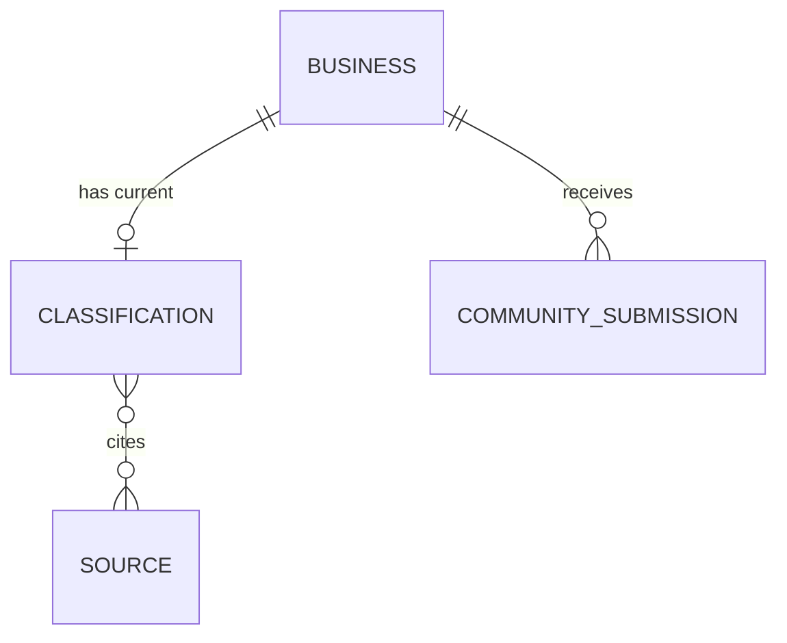

# Data Model

This document describes the core entities behind **Is It Local** and how they
relate. The canonical definitions live as JSON Schema (draft 2020-12) in
[`packages/shared/schema/`](../packages/shared/schema/) and are mirrored by
TypeScript types in [`packages/shared/src/types.ts`](../packages/shared/src/types.ts).
The JSON Schema is the single source of truth; language-specific types must stay
in sync with it.

## Entities

### Business

A physical business or place that can be classified by ownership.

| Field            | Type           | Required | Description                                                            |
| ---------------- | -------------- | -------- | ---------------------------------------------------------------------- |
| `id`             | uuid           | yes      | Stable unique identifier.                                              |
| `name`           | string         | yes      | Display name of the business.                                          |
| `address`        | object         | no       | Postal address (`street`, `city`, `region`, `postal_code`, `country`). |
| `location`       | GeoJSON Point  | yes      | `[longitude, latitude]` per RFC 7946.                                  |
| `categories`     | string[]       | no       | Category tags (e.g. `coffee_shop`).                                    |
| `contact`        | object         | no       | Public contact details (`phone`, `website`, `email`).                  |
| `brand`          | string \| null | no       | National/regional brand the business operates under.                   |
| `parent_company` | string \| null | no       | Parent company that owns the business or brand.                        |

Schema: [`business.schema.json`](../packages/shared/schema/business.schema.json)

### Ownership Classification

An ownership category assigned to a business, with a confidence score and cited
sources.

| Field            | Type             | Required | Description                                                     |
| ---------------- | ---------------- | -------- | --------------------------------------------------------------- |
| `business_id`    | uuid             | yes      | Identifier of the classified business.                          |
| `classification` | enum             | yes      | One of the six [classification values](#classification-values). |
| `confidence`     | number (0.0–1.0) | yes      | Confidence in the classification.                               |
| `sources`        | uuid[]           | yes      | References to `Source` ids used as evidence.                    |
| `updated_at`     | date-time        | yes      | When the classification was last updated.                       |

Schema: [`classification.schema.json`](../packages/shared/schema/classification.schema.json)

### Source

A piece of evidence retrieved from a provider that supports a classification.

| Field          | Type      | Required | Description                                                     |
| -------------- | --------- | -------- | --------------------------------------------------------------- |
| `id`           | uuid      | yes      | Stable unique identifier.                                       |
| `provider`     | string    | yes      | Origin (e.g. `openstreetmap`, `searxng`, `corporate_registry`). |
| `url`          | uri       | yes      | URL where the evidence was found.                               |
| `retrieved_at` | date-time | yes      | When the source was retrieved.                                  |
| `snippet`      | string    | no       | Relevant excerpt supporting the classification.                 |

Schema: [`source.schema.json`](../packages/shared/schema/source.schema.json)

### Community Submission

A user-submitted proposed classification with evidence, pending review.

| Field                     | Type      | Required | Description                                                     |
| ------------------------- | --------- | -------- | --------------------------------------------------------------- |
| `id`                      | uuid      | yes      | Stable unique identifier.                                       |
| `business_id`             | uuid      | yes      | Business the submission refers to.                              |
| `proposed_classification` | enum      | yes      | One of the six [classification values](#classification-values). |
| `evidence`                | string    | no       | Supporting evidence or reasoning.                               |
| `submitter_id`            | uuid      | yes      | User who made the submission.                                   |
| `status`                  | enum      | yes      | `pending`, `approved`, or `rejected`.                           |
| `created_at`              | date-time | yes      | When the submission was created.                                |

Schema: [`community-submission.schema.json`](../packages/shared/schema/community-submission.schema.json)

## Relationships

- A **Business** has at most one current **Ownership Classification**.
- An **Ownership Classification** cites zero or more **Sources** as evidence.
- A **Business** may receive many **Community Submissions**; approved
  submissions can update the business's classification.

## Classification values

Every classification is exactly one of six values. See
[classification-schema.md](classification-schema.md) for the definition and
boundaries of each category.

- `family_owned`
- `locally_owned`
- `independent`
- `franchise`
- `corporate_owned`
- `unknown`

Every classification carries a numeric `confidence` (0.0–1.0) and a list of
`sources` so users can judge the answer for themselves.
